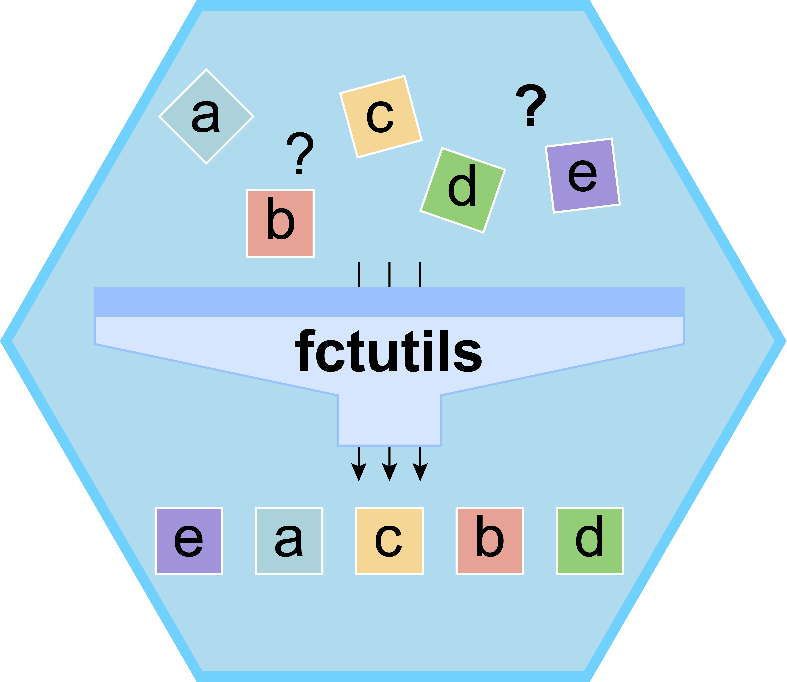

# 
# fctutils: Advanced Factor Manipulation Utilities for R
<a href="https://cran.r-project.org/web/packages/fctutils/index.html"></a>
 [](http://www.repostatus.org/#active)  [](https://github.com/guokai8/fctutils)  
[](https://cran.r-project.org/package=fctutils)


The `fctutils` package provides a comprehensive suite of utilities for advanced manipulation and analysis of factor vectors in R. It offers tools for splitting, combining, reordering, filtering, and transforming factor levels based on various criteria. Designed to enhance the handling of categorical data, `fctutils` simplifies complex factor operations, making it easier to preprocess and analyze data in R.

**Key Features**:

- **Advanced Sorting and Reordering**: Sort factor levels based on custom functions, external vectors, or associated data.
- **Factor Level Manipulation**: Functions to split, collapse, map, insert and extract substrings from factor levels.
- **Grouping and Aggregation**: Aggregate factor levels based on grouping variables or hierarchical categories.
- **Handling Missing Data**: Impute missing values in factors using various methods.
- **Consistency Across Datasets**: Ensure consistent factor levels across multiple vectors or datasets.


##  1. Software Usage
### 1.1 Installation
Install the package with its dependencies and load it for usage in R.
``` {r install, eval = FALSE}
library(devtools) # Load the devtools package
install_github("guokai8/fctutils") # Install the package
### or install from CRAN
install.packages('fctutils')
```
## 2. Useful functions
### 2.1 Ordering and Sorting Factors
_ft_pos_ Reorders the levels of a factor vector based on the characters at specified positions within the factor levels.
```{r}
library(fctutils)
factor_vec <- factor(c('Apple', 'banana', 'Cherry', 'date', 'Fig', 'grape'))
# Reorder based on positions 1 and 3, case-insensitive
ft_pos(factor_vec, positions = c(1, 3))
# Reorder in decreasing order, case-sensitive
ft_pos(factor_vec, positions = 1:2, case = TRUE, decreasing = TRUE)
```

_ft_count_ Reorders the levels of a factor vector based on the count of each level in the data.
```{r}
factor_vec <- factor(c('apple', 'banana', 'apple', 'cherry', 'banana', 'banana', 'date'))

# Reorder levels by decreasing count
ft_count(factor_vec)
# Reorder levels by increasing count
ft_count(factor_vec, decreasing = FALSE)
```
_ft_sub_ Reorders the levels of a factor vector based on substrings extracted from the factor levels.
```{r}
factor_vec <- factor(c('Apple', 'banana', 'Cherry', 'date', 'Fig', 'grape'))
# Reorder based on substring from position 2 to 4
ft_sub(factor_vec, start_pos = 2, end_pos = 4)

# Reorder from position 3 to end, case-sensitive
ft_sub(factor_vec, start_pos = 3, case = TRUE)
```
_ft_freq_ Reorders the levels of a factor vector based on the total frequency of characters appearing in the vector.
```{r}
factor_vec <- factor(c('apple', 'banana', 'cherry', 'date', 'banana', 'apple', 'fig'))

# Reorder levels based on total character frequency
ft_freq(factor_vec)

# Reorder levels, case-sensitive
factor_vec_case <- factor(c('Apple', 'banana', 'Cherry', 'date', 'banana', 'apple', 'Fig'))
ft_freq(factor_vec_case, case = TRUE)
```
_ft_char_freq_ Reorders the levels of a factor vector based on the frequency of characters at specified positions within the data.
```{r}
factor_vec <- factor(c('apple', 'banana', 'apricot', 'cherry', 'banana', 'banana', 'date'))

# Reorder based on characters at positions 1 and 2
ft_char_freq(factor_vec, positions = 1:2)

# Reorder, case-sensitive, decreasing order
ft_char_freq(factor_vec, positions = c(1, 3), case = TRUE)
```
_ft_substr_freq_ Reorders the levels of a factor vector based on the frequency of substrings extracted from the data.
```{r}
factor_vec <- factor(c('苹果', '香蕉', '苹果', '樱桃', '香蕉', '香蕉', '日期'))

# Reorder based on substrings from position 1 to 1
ft_substr_freq(factor_vec, start_pos = 1, end_pos = 1)

# Reorder from position 2 to end
ft_substr_freq(factor_vec, start_pos = 2)
factor_vec <- factor(c('apple', 'banana', 'apricot', 'cherry', 'banana', 'banana', 'date'))
ft_substr_freq(factor_vec, start_pos = 2, end_pos=3)
```
_ft_regex_freq_ Reorders the levels of a factor vector based on the frequency of substrings matching a regular expression.
```{r}
factor_vec <- factor(c('apple', 'banana', 'apricot', 'cherry', 'blueberry', 'blackberry', 'date'))

# Reorder based on pattern matching 'a'
ft_regex_freq(factor_vec, pattern = 'a')

# Reorder with case-sensitive matching
ft_regex_freq(factor_vec, pattern = '^[A-Z]', case = TRUE)
```
_ft_split_ Splits the levels of a factor vector using specified patterns or positions and reorders based on specified parts or criteria.
```{r}
# Example factor vector with patterns
factor_vec <- factor(c('item1-sub1', 'item2_sub2', 'item3|sub3', 'item1-sub4'))

# Split by patterns '-', '_', or '|' and reorder based on the first part
ft_split(factor_vec, split_pattern = c('-', '_', '\\|'), part = 1)

# Use the second pattern '_' for splitting
ft_split(factor_vec, split_pattern = c('-', '_', '\\|'), use_pattern = 2, part = 2)

# Reorder based on character frequencies in the specified part
ft_split(factor_vec, split_pattern = '-', part = 2, char_freq = TRUE)

```

_ft_len_ Reorders the levels of a factor vector based on the character length of each level.
```{r}
factor_vec <- factor(c('apple', 'banana', 'cherry', 'date'))

# Sort levels by length
ft_len(factor_vec)
```
_ft_sort_ Sorts the levels of a factor vector based on the values of another vector or a column from a data frame. Handles cases where the sorting vector may contain `NA`s.
```{r}
factor_vec <- factor(c('apple', 'banana', 'cherry', 'date'))
by_vec <- c(2, 3, 1, NA)
ft_sort(factor_vec, by = by_vec)

# Example using a data frame column
data <- data.frame(
  Category = factor(c('apple', 'banana', 'cherry', 'date')),
  Value = c(2, 3, 1, NA)
)
ft_sort(data$Category, by = data$Value)
```
_ft_sort_custom_ Reorders the levels of a factor vector based on a custom function applied to each level.
```{r}
factor_vec <- factor(c('apple', 'banana', 'cherry'))

# Sort levels by reverse alphabetical order
ft_sort_custom(factor_vec, function(x) -rank(x))

# Sort levels by length of the level name
ft_sort_custom(factor_vec, function(x) nchar(x))
```

### 2.2 Replacing Factor Levels
_ft_replace_ Replaces a specified level in a factor vector with a new level. If a position is provided, the new level is inserted at the specified position among the levels; otherwise, the original level order is preserved.
```{r}
factor_vec <- factor(c('apple', 'banana', 'cherry', 'date', 'fig', 'grape'))

# replace 'banana' as 'blueberry', and keep original order
ft_replace(factor_vec, old_level = 'banana', new_level = 'blueberry')

# replace 'banana' as 'blueberry'
ft_replace(factor_vec, old_level = 'banana', new_level = 'blueberry', position = 2)
```
_ft_replace_pattern_ Replaces parts of the factor levels that match a specified pattern with a new string.
```{r}
factor_vec <- factor(c('apple_pie', 'banana_bread', 'cherry_cake'))

# Replace '_pie', '_bread', '_cake' with '_dessert'
ft_replace_pattern(factor_vec, pattern = '_.*', replacement = '_dessert')
```

### 2.3 Filtering and Removing Factor Levels
_ft_filter_freq_ Filters out factor levels that occur less than a specified frequency threshold and recalculates character frequencies excluding the removed levels. Offers options to handle NA values and returns additional information.
```{r}
factor_vec <- factor(c('apple', 'banana', 'cherry', 'date', 'banana', 'apple', 'fig', NA))

# Filter levels occurring less than 2 times and reorder by character frequency
ft_filter_freq(factor_vec, min_freq = 2)

# Filter levels, remove NA values, and return additional information
result <- ft_filter_freq(factor_vec, min_freq = 2, na.rm = TRUE, return_info = TRUE)
result$filtered_factor
result$removed_levels
result$char_freq_table
```
_ft_filter_pos_ Removes factor levels where a specified character appears at specified positions within the levels.
```{r}
factor_vec <- factor(c('apple', 'banana', 'apricot', 'cherry', 'date', 'fig', 'grape'))

# Remove levels where 'a' appears at position 1
ft_filter_pos(factor_vec, positions = 1, char = 'a')

# Remove levels where 'e' appears at positions 2 or 3
ft_filter_pos(factor_vec, positions = c(2, 3), char = 'e')

# Case-sensitive removal
factor_vec_case <- factor(c('Apple', 'banana', 'Apricot', 'Cherry', 'Date', 'Fig', 'grape'))
ft_filter_pos(factor_vec_case, positions = 1, char = 'A', case = TRUE)
```
_ft_remove_levels_ Removes specified levels from a factor vector, keeping the remaining levels and their order unchanged.
```{r}
factor_vec <- factor(c('apple', 'banana', 'cherry', 'date', 'fig', 'grape'))

# Remove levels 'banana' and 'date'
ft_remove_levels(factor_vec, levels_to_remove = c('banana', 'date'))
```
_ft_filter_func_ Removes levels from a factor vector based on a user-defined  function.
```{r}
factor_vec <- factor(c('apple', 'banana', 'cherry', 'date'))

# Remove levels that start with 'b'
ft_filter_func(factor_vec, function(x) !grepl('^b', x))
```
### 2.4 Merging Factor Vectors
_ft_merge_similar_ Merges levels of a factor that are similar based on string distance.
```{r}
factor_vec <- factor(c('apple', 'appel', 'banana', 'bananna', 'cherry'))

# Merge similar levels
ft_merge_similar(factor_vec, max_distance = 1)
```
_ft_concat_ Combines multiple factor vectors into a single factor, unifying the levels.
```{r}
factor_vec1 <- factor(c('apple', 'banana'))
factor_vec2 <- factor(c('cherry', 'date'))

# Concatenate factors
concatenated_factor <- ft_concat(factor_vec1, factor_vec2)
levels(concatenated_factor)
```
_ft_combine_ Combines two vectors, which may be of unequal lengths, into a factor vector and sorts based on the levels of either the first or second vector.
```{r}
vector1 <- c('apple', 'banana', 'cherry')
vector2 <- c('date', 'fig', 'grape', 'honeydew')

# Combine and sort based on vector1 levels
ft_combine(vector1, vector2, sort_by = 1)

# Combine and sort based on vector2 levels
ft_combine(vector1, vector2, sort_by = 2)
```
### 2.5 Other Useful Functions
_ft_insert_ Inserts one or more new levels into a factor vector immediately after specified target levels. Targets can be identified by exact matches, positions, or pattern-based matching. Supports case sensitivity and handling of NA values. Can handle multiple insertions and maintains the original order of other levels. If a new level already exists in the factor and allow_duplicates is FALSE, it is moved to the desired position without duplication. If \code{allow_duplicates} is TRUE, unique duplicates are created.
```{r}
factor_vec <- factor(c('apple', 'banana', 'cherry', 'date', 'fig', 'grape'))
ft_insert(factor_vec, insert = 'date', target = 'banana', inplace = TRUE)
ft_insert(factor_vec, insert = c('date', 'grape'), positions = c(2, 4))
ft_insert(factor_vec, insert = 'honeydew', pattern = '^c')
factor_vec_na <- factor(c('apple', NA, 'banana', 'cherry', NA, 'date'))
ft_insert(factor_vec_na, insert = 'lychee', insert_after_na = TRUE)
#  Insert 'date' and 'elderberry' after position 2
factor_vec <- factor(c('apple', 'banana', 'cherry', 'fig', 'grape'))
new_factor <- ft_insert(factor_vec, insert = c('date', 'elderberry'), positions = 2,position = "after",inplace = FALSE)
#  Insert 'kiwi' at position exceeding the number of levels
new_factor_exceed <- ft_insert(factor_vec, insert = 'kiwi', positions = 10,  # Position exceeds number of levels  position = "after",  inplace = FALSE)
```
_ft_pairs_ Creates all unique pairwise combinations between factor_vec of a vector, with options for references, symmetry, NA handling, custom filtering, and output formats. Automatically handles factors by converting them to vectors and removes extra spaces from factor_vec before processing.
```{r}
vec <- c(' A', 'b ', ' C ', 'D')
# Generate pairwise comparisons within vec
ft_pairs(vec)
# Use a custom preprocessing function to convert factor_vec to lower case
ft_pairs(vec, pre_fn = function(x) tolower(trimws(x)))
ft_pairs(vec, ref = c("A","C"))
elements <- c('apple', 'apricot', 'banana', 'blueberry', 'cherry', 'cranberry')
filter_fn <- function(df) {
  substr(df$Var1, 1, 1) == substr(df$Var2, 1, 1)
}
pairs <- ft_pairs(elements, filter_fn = filter_fn)
```


_ft_intersect_ Combines multiple factor vectors and returns a factor vector containing only the levels common to all.
```{r}
factor_vec1 <- factor(c('apple', 'banana', 'cherry'))
factor_vec2 <- factor(c('banana', 'date', 'cherry'))
factor_vec3 <- factor(c('banana', 'cherry', 'fig'))

# Get intersection of levels
ft_intersect(factor_vec1, factor_vec2, factor_vec3)
```
_ft_union_ Combines multiple factor vectors and returns a factor vector containing all unique levels.
```{r}
factor_vec1 <- factor(c('apple', 'banana'))
factor_vec2 <- factor(c('banana', 'cherry'))
factor_vec3 <- factor(c('date', 'fig'))

# Get union of levels
ft_union(factor_vec1, factor_vec2, factor_vec3)
```
_ft_reorder_within_ Reorders the levels of a factor vector within groups defined by another factor vector.
```{r}
data <- data.frame(
  item = factor(c('A', 'B', 'C', 'D', 'E', 'F')),
  group = factor(c('G1', 'G1', 'G1', 'G2', 'G2', 'G2')),
  value = c(10, 15, 5, 20, 25, 15)
)
data <- rbind(data, data)
# Reorder 'item' within 'group' by 'value'
data$item <- ft_reorder_within(data$item, data$group, data$value, mean)
```
_ft_extract_ Extracts substrings from the levels of a factor vector based on a regular expression pattern and creates a new factor.
```{r}
factor_vec <- factor(c('item123', 'item456', 'item789'))

# Extract numeric part
ft_extract(factor_vec, pattern = '\\d+')

# Extract with capturing group
factor_vec <- factor(c('apple: red', 'banana: yellow', 'cherry: red'))
ft_extract(factor_vec, pattern = '^(\\w+):', capture_group = 1)
```
_ft_pad_levels_ Pads the levels of a factor vector with leading characters to achieve a specified width.
```{r}
# Example factor vector
factor_vec <- factor(c('A', 'B', 'C', 'D'))

# Pad levels to width 4 using '0' as padding character
padded_factor <- ft_pad_levels(factor_vec, width = 4, pad_char = '0')
print(levels(padded_factor))
# Output: "000A" "000B" "000C" "000D"

# Pad levels to width 6 using '%A' as padding string
padded_factor <- ft_pad_levels(factor_vec, width = 6, pad_char = '%A')
print(levels(padded_factor))
# Output: "%%A%A" "%%A%B" "%%A%C" "%%A%D"
```
_ft_level_stats_ Computes statistical summaries for each level of a factor vector based on associated numeric data. (group_by and summarize). 

_ft_pattern_replace_ Replaces substrings in factor levels that match a pattern with a replacement string. 

_ft_impute_ Replaces \code{NA} values in a factor vector using specified imputation methods. 

_ft_unique_comb_ Generates a new factor where each level represents a unique combination of levels from the input factors. 

_ft_map_func_ Transforms factor levels by applying a function that can include complex logic. 

_ft_collapse_lev_ Collapses specified levels of a factor into new levels based on a grouping list. 

_ft_duplicates_ Identifies duplicate levels in a factor vector and returns a logical vector indicating which elements are duplicates. 

_ft_dummy_ Generates a data frame of dummy variables (one-hot encoded) from a factor vector. 

_ft_replace_na_ Replaces \code{NA} values in a factor vector with a specified level. 

_ft_sample_levels_ Randomly selects a specified number of levels from a factor vector. 

_ft_apply_ Transforms factor levels by applying a function to each level. 

_ft_encode_ Converts the levels of a factor vector into numeric codes, optionally using a provided mapping. 

## 3. Summary
The `fctutils` package provides a comprehensive set of functions to efficiently manage and manipulate factor vectors in R. From ordering and sorting to replacing, filtering, merging, and beyond, these tools enhance your ability to handle categorical data with ease. The additional essential functions further extend the package's capabilities, ensuring that all common factor operations are covered. I might change the logo in the future ^^

## 4. Contact information
For any questions please contact guokai8@gmail.com or submit the issues to https://github.com/guokai8/fctutils/issues


